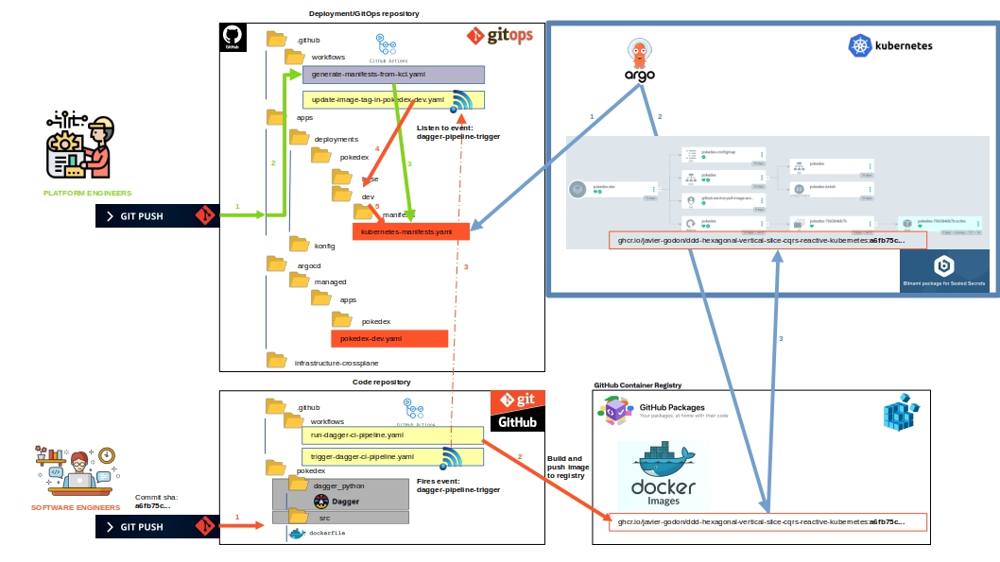

# Cluster Continuous Delivery

This repository is designed to facilitate the deployment of projects on Kubernetes using modern tools like Crossplane, KCL, and ArgoCD. It is organized into four main directories, each serving a specific purpose:

---

## 📂 [.github](https://github.com/Javier-Godon/cluster-continuous-delivery/tree/main/.github)

This folder contains workflows for **GitHub Actions**, divided into two main groups:

1. **Image Tag Update Workflows**  
   These workflows automatically update the container image tag in the Kubernetes manifests whenever changes to the project code are merged into the `main` branch.

2. **Kubernetes Manifest Update Workflow**  
   The [generate-manifests-from-kcl.yaml](https://github.com/Javier-Godon/cluster-continuous-delivery/blob/main/.github/workflows/generate-manifests-from-kcl.yaml) workflow updates Kubernetes manifests manually when deployment configuration files are modified.

---

## 📂 [apps](https://github.com/Javier-Godon/cluster-continuous-delivery/tree/main/apps)

This folder contains the **KCL configurations** required to generate Kubernetes manifests for deployment. 

- The repository uses the [Konfig](https://www.kcl-lang.io/docs/user_docs/guides/working-with-konfig/overview) library from KCL, enabling the generation of all necessary manifests with minimal configuration.  
- Each project has its own subfolder:
  - A `base` folder containing shared project configurations.
  - Environment-specific folders (e.g., `dev`, `prod`) with configurations unique to that environment.

### ✨ Key Features:
- **Dynamic ConfigMaps**: Using string interpolation, variables, and schemas in KCL, you can easily define and manage Kubernetes ConfigMaps.

---

## 📂 [infrastructure-crossplane](https://github.com/Javier-Godon/cluster-continuous-delivery/tree/main/infrastructure-crossplane)

This folder contains the necessary **Crossplane manifests** and **Custom Resource Definitions (CRDs)** for each provider to deploy the required infrastructure for each project. 

- The `managed_resources` folder organizes the manifests by tool, making it easy to locate and manage resources.

---

## 📂 [argocd](https://github.com/Javier-Godon/cluster-continuous-delivery/tree/main/argocd)

This folder includes the **ArgoCD manifests** required to implement GitOps, ensuring that the Kubernetes resources defined in the repository are deployed and synchronized effectively.

---

## 📖 Blueprint

To understand the overall architecture of this repository, please refer to the slide [continuous_delivery_blueprint.odp](resources/continuous_delivery_blueprint.odp).

As described in the slide, the system consists of the following components:

### Overview

1. **Code Repositories**  
   Each application/microservice has its own code repository.  
   - In this repository structure, there is a folder for the project (e.g., `pokedex`) containing:
     - A `src` folder with the application code (e.g., Java for the Pokedex project).
     - A `dagger_python` folder with a Python project implementing a CI/CD pipeline using Dagger. This Python project includes all necessary requirements and configurations to run in a container.
     - A `.github` folder defining the GitHub Actions workflows:
       - `run-dagger-ci-pipeline.yaml`: Executes the pipeline in the `dagger_python` folder to build a container image, assign it a commit SHA-based tag, and push it to the container registry.
       - `trigger-dagger-ci-pipeline.yaml`: Emits a custom event (`dagger-pipeline-trigger`) with the commit SHA in its payload.

2. **Deployment/GitOps Repository**  
   - This repository contains the folder structure to generate the final Kubernetes manifests ArgoCD uses as the desired state. It includes:
     - **Infrastructure-Crossplane**: Contains Crossplane manifests and resources for infrastructure deployment.
     - **ArgoCD Manifests**: Defines how each application/environment is deployed. For example, `argocd/managed/apps/pokedex/pokedex-dev.yaml` specifies the desired state for the Pokedex application in the `dev` environment.
     - **Apps Folder**: Defines configurations in KCL to build final YAML manifests:
       - A `base` folder for common configurations across environments.
       - Environment-specific folders (`dev`, `stg`, `prod`) containing the final YAML manifests under the `manifests` folder (e.g., `apps/deployments/pokedex/dev/manifests/kubernetes-manifests.yaml`).
     - **GitHub Workflows**:
       - `generate-manifests-from-kcl.yaml`: Updates the YAML manifests when a platform engineer modifies KCL files in this repository.
       - Environment-specific workflows (e.g., `update-image-tag-in-pokedex-dev.yaml`) that update the container image tag in the corresponding YAML manifest.

3. **GitHub Container Registry**  
   - Stores container images for each application, tagged based on the commit SHA. A new image is generated and tagged every time a commit is merged into `main`.

4. **Kubernetes Cluster**  
   - Hosts the GitOps tool (ArgoCD), which continuously reconciles the desired state (defined in the GitOps repository's YAML manifests) with the actual state in the cluster.
   - Utilizes **Sealed Secrets** to securely encrypt and store secrets in the GitOps repository. ArgoCD ensures the container images described in the YAML manifests are downloaded from the GitHub Container Registry.

---

This section provides a high-level overview of the system's blueprint. Future sections will delve deeper into each component, its configuration, and its interaction with the system as a whole.

