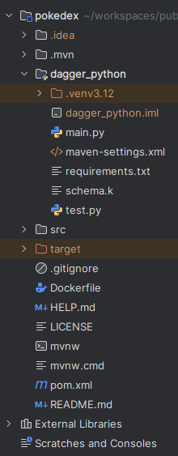
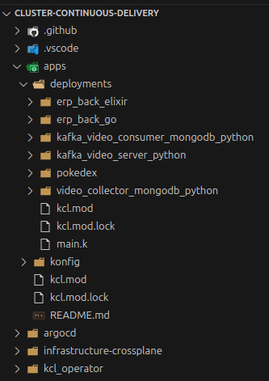
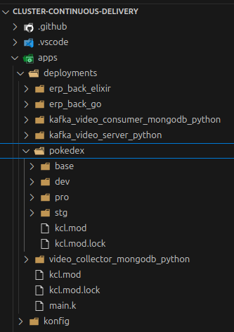
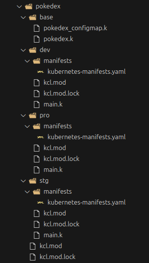
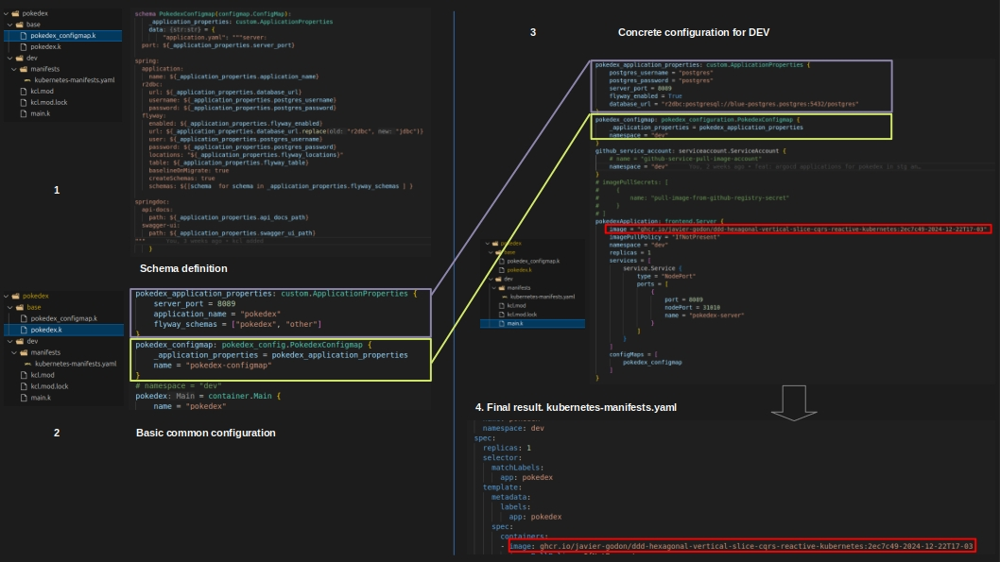
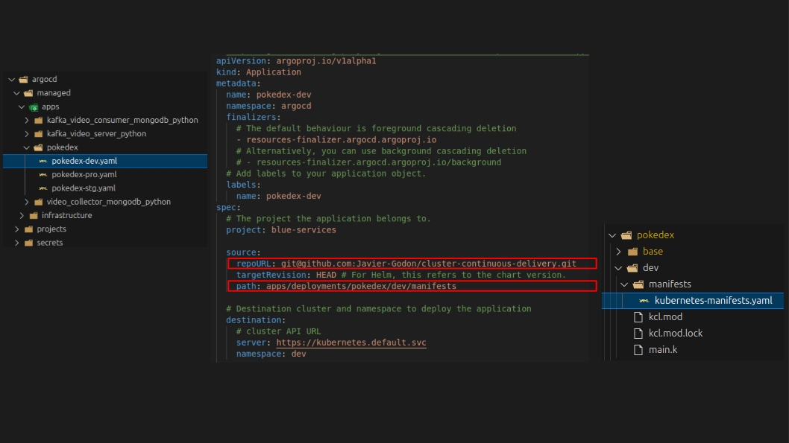
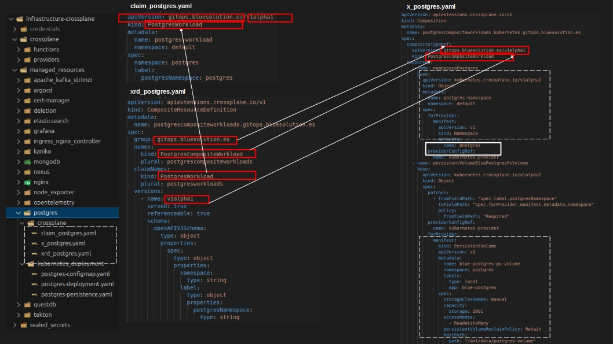
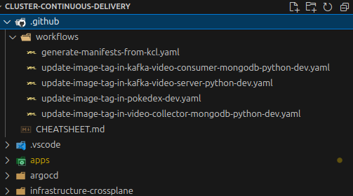
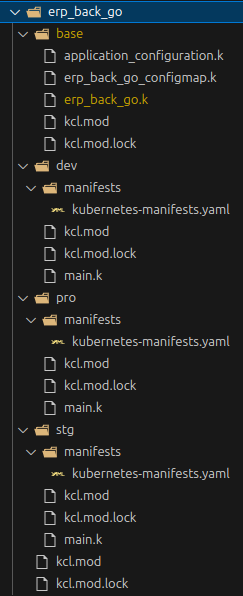

# Cluster Continuous Delivery

This repository is designed to facilitate the deployment of projects on Kubernetes using modern tools like Crossplane, KCL, and ArgoCD. It is organized into four main directories, each serving a specific purpose:

---

## 📂 [.github](https://github.com/Javier-Godon/cluster-continuous-delivery/tree/main/.github)

This folder contains workflows for **GitHub Actions**, divided into two main groups:

1. **Image Tag Update Workflows**  
   These workflows automatically update the container image tag in the Kubernetes manifests whenever changes to the project code are merged into the `main` branch.

2. **Kubernetes Manifest Update Workflow**  
   The [generate-manifests-from-kcl.yaml](https://github.com/Javier-Godon/cluster-continuous-delivery/blob/main/.github/workflows/generate-manifests-from-kcl.yaml) workflow updates Kubernetes manifests manually when deployment configuration files are modified.

---

## 📂 [apps](https://github.com/Javier-Godon/cluster-continuous-delivery/tree/main/apps)

This folder contains the **KCL configurations** required to generate Kubernetes manifests for deployment. 

- The repository uses the [Konfig](https://www.kcl-lang.io/docs/user_docs/guides/working-with-konfig/overview) library from KCL, enabling the generation of all necessary manifests with minimal configuration.  
- Each project has its own subfolder:
  - A `base` folder containing shared project configurations.
  - Environment-specific folders (e.g., `dev`, `prod`) with configurations unique to that environment.

### ✨ Key Features:
- **Dynamic ConfigMaps**: Using string interpolation, variables, and schemas in KCL, you can easily define and manage Kubernetes ConfigMaps.

---

## 📂 [infrastructure-crossplane](https://github.com/Javier-Godon/cluster-continuous-delivery/tree/main/infrastructure-crossplane)

This folder contains the necessary **Crossplane manifests** and **Custom Resource Definitions (CRDs)** for each provider to deploy the required infrastructure for each project. 

- The `managed_resources` folder organizes the manifests by tool, making it easy to locate and manage resources.

---

## 📂 [argocd](https://github.com/Javier-Godon/cluster-continuous-delivery/tree/main/argocd)

This folder includes the **ArgoCD manifests** required to implement GitOps, ensuring that the Kubernetes resources defined in the repository are deployed and synchronized effectively.

---

## 📖 Blueprint


To understand the overall architecture of this repository, please refer to the slide [continuous_delivery_blueprint.odp](resources/continuous_delivery_blueprint.odp).

As described in the slide, the system consists of the following components:

### Overview

1. **Code Repositories**  
   Each application/microservice has its own code repository.  
   - In this repository structure, there is a folder for the project (e.g., `pokedex`) containing:
     - A `src` folder with the application code (e.g., Java for the Pokedex project).
     - A `dagger_python` folder with a Python project implementing a CI/CD pipeline using Dagger. This Python project includes all necessary requirements and configurations to run in a container.
     - A `.github` folder defining the GitHub Actions workflows:
       - `run-dagger-ci-pipeline.yaml`: Executes the pipeline in the `dagger_python` folder to build a container image, assign it a commit SHA-based tag, and push it to the container registry.
       - `trigger-dagger-ci-pipeline.yaml`: Emits a custom event (`dagger-pipeline-trigger`) with the commit SHA in its payload.

2. **Deployment/GitOps Repository**  
   - This repository contains the folder structure to generate the final Kubernetes manifests ArgoCD uses as the desired state. It includes:
     - **Infrastructure-Crossplane**: Contains Crossplane manifests and resources for infrastructure deployment.
     - **ArgoCD Manifests**: Defines how each application/environment is deployed. For example, `argocd/managed/apps/pokedex/pokedex-dev.yaml` specifies the desired state for the Pokedex application in the `dev` environment.
     - **Apps Folder**: Defines configurations in KCL to build final YAML manifests:
       - A `base` folder for common configurations across environments.
       - Environment-specific folders (`dev`, `stg`, `prod`) containing the final YAML manifests under the `manifests` folder (e.g., `apps/deployments/pokedex/dev/manifests/kubernetes-manifests.yaml`).
     - **GitHub Workflows**:
       - `generate-manifests-from-kcl.yaml`: Updates the YAML manifests when a platform engineer modifies KCL files in this repository.
       - Environment-specific workflows (e.g., `update-image-tag-in-pokedex-dev.yaml`) that update the container image tag in the corresponding YAML manifest.

3. **GitHub Container Registry**  
   - Stores container images for each application, tagged based on the commit SHA. A new image is generated and tagged every time a commit is merged into `main`.

4. **Kubernetes Cluster**  
   - Hosts the GitOps tool (ArgoCD), which continuously reconciles the desired state (defined in the GitOps repository's YAML manifests) with the actual state in the cluster.
   - Utilizes **Sealed Secrets** to securely encrypt and store secrets in the GitOps repository. ArgoCD ensures the container images described in the YAML manifests are downloaded from the GitHub Container Registry.

---

This section provides a high-level overview of the system's blueprint. Future sections will delve deeper into each component, its configuration, and its interaction with the system as a whole.

## Code Repositories

To implement CI using Dagger, we embed a lightweight Python application into each project. This replaces traditional CI configurations like `Jenkinsfile` (specific to Jenkins) or Tekton pipeline manifests (specific to Tekton). This approach offers significant advantages:

- **Portability**: Pipelines run as programs within containers, making them compatible with any environment (Jenkins, Tekton, GitHub Actions, local machines, etc.).
- **Infrastructure Agnostic**: The pipeline runs seamlessly across platforms without modification, simplifying migrations and execution.
- **Local Testing**: Developers can execute and test pipelines locally, ensuring reliability before committing changes.

### Example Project
For this example, we use a **Java/Spring Boot project**:  



👉 [Java Project Repository](https://github.com/Javier-Godon/ddd-hexagonal-vertical-slice-cqrs-reactive-kubernetes)

The Python project for defining the Dagger pipeline resides here:  
👉 [Dagger Python Project](https://github.com/Javier-Godon/ddd-hexagonal-vertical-slice-cqrs-reactive-kubernetes/tree/main/pokedex/dagger_python)

The pipeline script can be found here:  
👉 [Pipeline Script](https://github.com/Javier-Godon/ddd-hexagonal-vertical-slice-cqrs-reactive-kubernetes/blob/main/pokedex/dagger_python/main.py)

---

### Setting Up the Python Project in IntelliJ for a Spring Boot Repository

Follow these steps to include the Python Dagger project in your existing Java/Spring Boot repository:

1. **Install Python Plugin**  
   Install the Python plugin in IntelliJ IDEA.

2. **Create a Virtual Environment**  
   ```
   python3 -m venv .venv3.12
   ```
3. **Ignore Virtual Environment**
   
   - Add .venv3.12 to .gitignore.
   
4. **Activate Virtual Environment**
   For Ubuntu/Linux:
   ```
   source .venv3.12/bin/activate
   ```
5. **Add Python SDK**

    - Go to File > Project Structure > SDKs.
    - Add the Python interpreter:
    - Path: .venv3.12/bin/python (Linux/macOS) or .venv3.12/Scripts/python.exe (Windows).
    - Name it .venv3.12.   
6. **Create a New Module for Python**

    - Go to File > Project Structure > + Add Module.
    - Select Python as the module type.
    - Name the module dagger_python and place it inside the root of the project (e.g., pokedex).
    - Use .venv3.12 as the virtual environment.
7. **Mark as Python Source Root**
   - Right-click the dagger_python folder > Mark Directory as > Sources Root.    
8. **Initialize Files**
    - Create main.py for your pipeline logic.
    - Create requirements.txt to manage dependencies.
9. **Exclude Virtual Environment Folder**
    - Right-click .venv3.12 > Mark Directory as > Excluded.
10. **Initialize Dagger Module**
    - Run the following command from the root directory:
      ```
      dagger init --sdk=python --source=./dagger_python
      ```

Once this setup is complete, you can run the pipeline from any environment by executing: 
```
      python3 dagger_python/main.py
```

---
### GitHub Actions Workflows
Since GitHub Actions is the chosen CI tool, two workflows need to be defined:

Run CI Pipeline
This workflow, triggered on merges to the main branch, executes the Dagger pipeline:

👉 run-dagger-ci-pipeline.yaml

Trigger CD Pipeline
This workflow emits an event captured by the deployment repository, updating manifests with the new image tag:

👉 trigger-dagger-ci-pipeline.yaml

## Deployment/GitOps Repository

This repository is structured into four main folders, each serving a distinct purpose in the GitOps workflow:

### 1. **apps**
- **Purpose**: Configures the deployments for each application.
- **Output**: A `kubernetes-manifests.yaml` file is generated within the `manifests` folder for each environment and application.
- **Implementation**: Defined and structured using **KCL** and the **Konfig project** for consistent and reusable configurations.

### 2. **argocd**
- **Purpose**: Contains ArgoCD manifests.
- **Organization**: Managed by platform engineers, the manifests are organized by application and environment.

### 3. **infrastructure-crossplane**
- **Purpose**: Provides the configurations for Crossplane.
- **Functionality**: Enables Kubernetes to act as an orchestrator by reconciling the desired state with the actual state of the infrastructure.

### 4. **.github**
- **Purpose**: Hosts GitHub Actions workflows.
- **Functionality**:
  - Orchestrates updates to the Kubernetes manifests (`kubernetes-manifests.yaml`).
  - Handles actions triggered by platform engineers on this repository or by software engineers merging changes into `main`.
  - Automatically updates image tags specified in the Kubernetes deployments of `kubernetes-manifests.yaml`.

This structure ensures a clear separation of concerns, empowering both platform and software engineers to collaborate seamlessly in maintaining deployments and infrastructure state.

### 1. **apps**



The `apps` folder is based on **KCL language** ([KCL](https://www.kcl-lang.io/)) and its project **Konfig** ([Konfig GitHub](https://github.com/kcl-lang/konfig)). A detailed description of Konfig can be found [here](https://www.kcl-lang.io/docs/user_docs/guides/working-with-konfig/overview).

KCL files use the `.k` extension, while dependency files use `.mod` and `.mod.lock`. The `apps` folder contains two subfolders:

#### **konfig**
- Includes the entire Konfig project.
- Responsible for generating all Kubernetes manifests in YAML format.
- Uses minimal configurations written in KCL language.
- Specific configurations for each application and environment are located in the `deployments` folder.

#### **deployments**
- Organized by application, where each application has its own folder.
- Inside each application folder:
  - A `base` folder contains common configuration for the application.
  - Environment-specific folders (e.g., `dev`, `prod`) each have a `main.k` file with the environment-specific configuration.
- The final YAML manifests are generated in the `manifests` folder as the file `kubernetes-manifests.yaml`.

##### Example: Pokedex Project (Java Spring Boot)




- The Pokedex application has an environment folder `dev` with:
  - `pokedex-configmap.k`: Defines the Spring Boot `application.yaml`, where each configuration can be specified via a variable.
  - `pokedex.k`: Configures the Kubernetes manifests to generate.
  - `dev/main.k`: Specifies the environment-specific configurations for development.
- To generate the YAML manifests, run the following command from the root of the project:
  ```
  kcl -r apps/deployments/pokedex/dev -o apps/deployments/pokedex/dev/manifests/kubernetes-manifests.yaml
  ```

Thanks to KCL:

Updating the image tag is straightforward since it is a parameter of a schema that can be easily configured.
There's no need for complex text parsing scripts to modify the configuration.
This structure ensures a clean, maintainable way to manage Kubernetes manifests for multiple applications and environments. 

---
**full process to define the deployment of an app**
```  
   Create folders base and dev,stg,pro,...(depending on your case)
   over the folder with the name of the project (ex: apps/deployments/pokedex):
   kcl mod init
   kcl mod add k8s:1.31.2 
   kcl mod add ../../konfig
   kcl mod add ../../deployments

   and delete the folder main.k that will be created

   over the rest of the folders environment folder f(base,dev, stg, pro,..) do:
   kcl mod init 
   kcl mod add k8s:1.31.2 
   kcl mod add ../../../konfig 
   kcl mod add ../../../deployments 

   over every environment add this line to kcl.mod

   [profile]
   entries = ["../base/<project_name>.k", "main.k", "${konfig:KCL_MOD}/models/kube/render/render.k"]

   in folder base create the file: <project-name>.k like pokedex.k
   (make sure the name of the folder that contains the project has the same name as project-name)
   Create a <project_name_configmap>.k like pokedex_configmap.k

   for a python project create too:
   application_configuration.k

You can find examples for projects in Java/Spring Boot (pokedex), Python (kafka_video_server_python, kafka_video_consumer_mongodb_python), GoLang (erp_back) and Elixir/Phoenix
   
```
---




As we can see in the image, KCL allows us to define schemas, such as `PokedexConfigmap` (as shown in **1. Schema definition**), which contains a series of configurable parameters. In our case, we use this schema as a class (in Object-Oriented Programming terminology) to generate a ConfigMap. This ConfigMap will overwrite the `application.yaml` configuration file of our Spring Boot project for each environment. The advantage is that, as we can see, each value is a configurable parameter.

In **2. Basic common configuration**, we create what in Object-Oriented Programming terminology would be the concrete classes or instances based on the schemas defined in KCL. These schemas could be:
- Our custom-defined schemas.
- Schemas provided by the Konfig project of KCL.
- Schemas from the [k8s:1.31.2](https://artifacthub.io/packages/kcl/kcl-module/k8s) module, which we imported into our KCL project definition. This module essentially contains the schemas of the Kubernetes API.

We can observe that generic parameters for all environments are defined, such as `server_port`, `application_name`, and `flyway_schemas` for our `application.yaml`. Similarly, generic configurations are defined for the ConfigMap and what in Konfig represents the main configuration for the container.

Later, in **3. Concrete configuration for DEV**, we define specific configurations for the development environment. Unlike Helm or Kustomize, we do not work with plain text and apply composition. Instead, our `pokedex_configmap` object will already include the parameter values defined in **2** and additionally any specific parameters we indicate at this stage, such as `namespace = "dev"`.

More importantly, as we can see, `frontend.Server` (a Konfig schema from KCL) contains a parameter `image`, which will be used to generate the `image` parameter of the Kubernetes deployment in YAML format (**4. Final result kubernetes-manifests.yaml**). This enables us to modify it easily and 
automatically within our CI/CD process.

---

### 2. **argocd**




In the `argocd` folder, we find the ArgoCD manifests grouped by application and environment. As an example, the image shows the manifest for the `pokedex` application in the `dev` environment.

When we apply this Kubernetes object to our cluster (`kubectl apply -f pokedex-dev.yaml`), ArgoCD will continuously monitor any changes in the repository specified in `source.repoURL` (in our case, this is our Deployment/GitOps repository). Specifically, it will track the contents of the folder indicated in `source.path` (`apps/deployments/dev/manifests`) and reconcile the desired state defined in that path with what is actually deployed in the namespace dev of our cluster. This reconciliation happens constantly, by default every 3 minutes.

This way, any change made to the `kubernetes-manifests.yaml` file in that folder (for example, a change in the tag of the image to be deployed) will be detected and applied automatically (or manually, depending on the configuration we specify for each environment).

---

### 3. **infrastructure-crossplane**



Suppose we want to deploy PostgreSQL in our cluster. For this, we navigate to the `postgresql` folder, where we find a subfolder named `crossplane`. This folder will always contain the following:

1. A [Composite Resource Definition (XRD)](https://docs.crossplane.io/latest/concepts/composite-resource-definitions/), in our case, `xrd_postgresql.yaml`.  
2. A [Composition](https://docs.crossplane.io/latest/concepts/compositions/), in our case, `x_postgresql.yaml`.  
   This composition is based on the XRD and specifies exactly which components we want Crossplane to reconcile in our cluster and which provider will handle them. In our case, since we are deploying directly onto our cluster, we use the [Kubernetes Provider](https://github.com/crossplane-contrib/provider-kubernetes). A complete list of available providers can be found on the [Upbound Marketplace](https://marketplace.upbound.io/providers).  
3. A [Claim](https://docs.crossplane.io/latest/concepts/claims/), in our case, `claim_postgresql.yaml`.  

To deploy this infrastructure, the deployment order must always be:  
**Composite Resource Definition -> Composition -> Claim**.

```
kubectl apply -f xrd_postgresql.yaml
kubectl apply -f x_postgresql.yaml
kubectl apply -f claim_postgresql.yaml
```

### 4. **.github**



### Explanation of the `.github` Folder

This folder contains the necessary resources for configuring the CI/CD aspects related to GitHub Actions.  

> **Note:** As mentioned, our Dagger pipelines can run anywhere, so we could choose any other tool, such as Jenkins or Tekton, without needing to modify these pipelines.  

We have two types of workflows:

1. **Workflow to update `kubernetes-manifests.yaml` when a Platform Engineer makes changes in this repository (Deployment/GitOps repository).**  
   For example, suppose the file `apps/deployments/pokedex/base/pokedex.k` is modified. Since this file is a generic configuration for the Pokedex application and affects all environments, this change will trigger the workflow `generate-manifests-from-kcl.yaml`.  
   This workflow will update the three `kubernetes-manifests.yaml` files in the respective subfolders for each environment (dev, pro, and stg).  
   While this updates the manifests, it does not modify the image tag of our application. However, ArgoCD will detect these changes and apply them to the cluster as soon as it identifies the updates.  
   To generate the new manifests, the corresponding KCL command is used:  
   ```
   kcl -d apps/deployments/$SERVICE/$ENVIRONMENT -o $OUTPUT_DIR/kubernetes-manifests.yaml
   kcl -d apps/deployments/$PROJECT/$ENV -o $OUTPUT_DIR/kubernetes-manifests.yaml
   ```

2. **Workflow per application and environment**
   For example, for Pokedex in the dev environment, we have the workflow update-image-tag-in-pokedex-dev.yaml.

   As shown, modifying the image tag is straightforward with KCL. We simply update the value of a parameter, **pokedexApplication.image** in a well-defined schema.
   Since we are using Python, we utilize the library [kcl-lib](https://pypi.org/project/kcl-lib/).
   ```
   python -c "
          import kcl_lib.api as api

          file = 'apps/deployments/pokedex/dev/main.k'
          specs = [f'pokedexApplication.image=\"ghcr.io/javier-godon/ddd-hexagonal-vertical-slice-cqrs-reactive-kubernetes:${{ github.event.client_payload.image_tag }}\"']
          args = api.OverrideFile_Args(file=file, specs=specs)
          api.API().override_file(args)
          "
   ```

   After modifying this parameter, we regenerate the corresponding kubernetes-manifests.yaml files.
   ```
   kcl -r apps/deployments/pokedex/dev -o apps/deployments/pokedex/dev/manifests/kubernetes-manifests.yaml
   ```
   In this case, what is being modified is the image tag in the manifests, unlike the previous case.  

   > **Note:** Remember that this workflow is triggered by a `repository_dispatch` event: `image-tag-in-pokedex-dev-updated`. This means it runs after the corresponding CI pipeline has executed in the Pokedex application repository because a developer merged changes into the `main` branch. These changes result in a new image being built, tagged, and pushed to our registry.  

   As a result, ArgoCD in this case will need to pull the new image with the specified tag in the `kubernetes-deployment.yaml` from the registry and redeploy the application with the updated version.  

---
## Tool Selection: A Comprehensive Rationale


## Why KCL?
   As stated in its [documentation](https://www.kcl-lang.io/docs/user_docs/getting-started/intro):

   Communities have been making significant efforts to improve their configuration technologies, which can be categorized into three groups:

   - Low-level data format-based tools: Utilize external tools to enhance reuse and validation, specifically for templating, patching, and validation.
   - Domain-Specific Languages (DSLs) and Configuration Languages (CLs): Improve language capabilities.
   - General Purpose Language (GPL)-based solutions: Use frameworks like Cloud Development Kit (CDK) to define configurations.

   Simplifying the Options:

   - YAML/JSON/Kustomize/Helm: Best for structured key-value pairs or Kubernetes-native tools.
   - HCL: Great for removing boilerplate with good human readability, especially for Terraform users.
   - CUE: Recommended for type systems that improve stability and scalability.
   - KCL: Ideal for modern modeling with type systems, scalable configurations, pure functions, rules, and automation.

   Comparisons with Other Tools:

   - vs. YAML/JSON: YAML/JSON are limited for large-scale configuration changes. KCL abstracts configuration data, enabling more flexibility for multi-environment setups.
   - vs. Jsonnet/GCL: Jsonnet and GCL reduce boilerplate but have runtime errors, weak type-checking, and performance issues for large templates. KCL outperforms in static type checking and large-scale scenarios.
   - vs. HCL: HCL struggles with complex object definitions and resource constraints, whereas KCL is self-contained and provides better integration with cloud-native tools.
   - vs. CUE: CUE is strong in constraints but has runtime bottlenecks for large models. KCL’s declarative syntax and static compilation make it more scalable and easier to use.
   - vs. Helm: Helm is templated YAML with package management but lacks robust model abstraction. KCL’s flexible merge strategies and static analysis outperform Helm for advanced use cases.

   > **Note:** While **Timoni** is an innovative Helm alternative, I’ve chosen KCL due to its superior documentation and active community.
   This choice is personal and not a blanket recommendation against Timoni or any other tools

## Why not Helm? 

   Helm is one of the most popular tools for managing Kubernetes manifests, but it's not without its drawbacks. 
   Choosing alternatives like KCL, CUE, or Timoni might be more appropriate in some scenarios depending on your use case.
   Helm is a solid tool with a proven track record, but its templating complexity, lack of strict validation, and stateful operations can make it less suitable for teams seeking a modern, declarative, and GitOps-friendly approach to Kubernetes management.
   Tools like KCL, CUE, and Timoni offer more robust validation, modularity, and composability, making them excellent alternatives for cloud-native infrastructure management.

   Here's an analysis of the cons of Helm and why other tools could be better alternatives:
###   Cons of Helm
* Imperative Tendencies in Operations
    * Helm charts can be operated imperatively (helm install, helm upgrade, helm rollback), which can lead to manual interventions and make the deployment history harder to track in a GitOps workflow.
    * This goes against the declarative principles that tools like Kubernetes aim to promote.

* YAML Templating Complexity
    * Helm uses Go templates for YAML generation, which can become verbose and error-prone. The templating syntax is not intuitive for many developers, especially when dealing with complex logic.
    * Debugging Helm templates can be challenging since syntax errors or logic issues only surface at runtime.

* Lack of Schema Validation
    * Helm charts don't enforce strict schema validation out of the box. Errors in values files or templates can go unnoticed until they cause runtime issues.
    * Tools like KCL and CUE provide robust type and schema validation, catching errors early during development.

* Limited Composability
    * Helm lacks native support for deeply composable configurations. Complex deployments often result in duplication or hard-to-maintain templates.
    * Alternatives like CUE or Timoni inherently support better modularity and composability.

* Upgrade and Rollback Challenges
    * While Helm allows for upgrades and rollbacks, they can sometimes lead to unexpected behaviors, especially if the templates include logic that doesn't cleanly handle changes.
    * Stateful resources can end up in inconsistent states without additional care.

* State Dependency on Tiller/Release Data
    * Helm tracks release history in its own storage (ConfigMaps or Secrets). If this data is corrupted or lost, it can be challenging to recover the exact state of a deployment.
    * Alternatives like KCL and CUE do not rely on external state storage but instead focus on stateless, declarative configurations.

* Large Learning Curve for Complex Scenarios
    * Helm's extensive feature set and reliance on Go templating can create a steep learning curve, especially for developers who are not familiar with the templating language.   

## Why Not Jenkins?

   While Jenkins has been a staple CI/CD tool for years, several drawbacks make it less favorable to me compared to more modern tools:

   Key Limitations of Jenkins:
   - **Complex Setup:** Requires significant setup and maintenance, particularly for plugins and distributed builds.
   - **Plugin Dependency:** Heavy reliance on plugins can lead to fragility and upgrade challenges.
   - **UI/UX:** Outdated user interface compared to modern alternatives.
   - **Scaling Issues:** Scaling Jenkins for distributed builds often requires additional infrastructure and expertise.
   - **Manual Configuration:** Lacks native support for declarative pipeline definitions, making it less suited for GitOps workflows.
   - **Security Risks:** Longstanding concerns about security vulnerabilities in plugins and configurations.
   - **Community Shift:** Modern tools like GitHub Actions, GitLab CI, and Tekton offer better community support and faster innovation cycles.

   Jenkins has long been a cornerstone of CI/CD pipelines, enabling organizations to automate build and deployment processes effectively.
   However, as technology has evolved, Jenkins’ architecture and design philosophy are showing their age.
   While it remains a powerful tool, it’s increasingly clear that Jenkins was built for an earlier era, one defined by static infrastructure and siloed teams.

   ## Challenges with Jenkins in the Modern DevOps Landscape
   1. **Legacy Architecture: Master-Agent Model**
   Jenkins’ architecture is based on a master node orchestrating multiple build agents.
   While this model scales to handle diverse workloads, it reflects a static and resource-heavy approach:

      - Static Build Agents: Each agent is typically configured for a specific purpose (e.g., Windows for .NET, Linux for Java).
       Adding support for new environments (e.g., Go) requires provisioning new agents, which can be time-consuming and prone to errors.
      - Heavy Infrastructure Costs: Agents are often virtual or even physical machines, leading to inefficiencies compared to ephemeral, container-based infrastructure.
       This approach feels outdated in an era where infrastructure is expected to be dynamic and on-demand.

   2. **Dependency on Plugins**
         Jenkins relies heavily on plugins to extend functionality, which introduces complexity and risk:

      - Configuration Overhead: Features like Docker build agents, Kubernetes integration, or ephemeral build environments require additional plugins.
       These plugins need constant updates, and dependencies between them can cause compatibility issues.
      - Steep Learning Curve: Teams often spend significant time configuring and maintaining plugins instead of focusing on delivering value.

      The reliance on plugins creates a fragile ecosystem that contrasts with the simplicity and robustness expected in cloud-native workflows.

   3. **Static Infrastructure Mentality**
   Jenkins was designed in a time when static servers in data centers were the norm. While it can integrate with modern tools, this is often a retrofit rather than a seamless experience:

      - Manual Provisioning: The default setup assumes long-lived build agents. Adopting more dynamic setups, like Dockerized agents or Kubernetes, requires significant manual effort.
      - Limited Agility: In fast-paced environments, teams need pipelines that can adapt and scale with minimal intervention. Jenkins’ static infrastructure assumptions can slow teams down.

   4. **Operational Complexity**
   The administrative burden of Jenkins is significant compared to modern CI/CD solutions:

      - Maintenance-Heavy: Jenkins requires frequent maintenance for its master node and agents, including security updates, performance tuning, and backups.
      - Scaling Challenges: Scaling Jenkins often involves setting up additional hardware or VMs, which can be costly and labor-intensive.
       This contrasts with cloud-native systems designed to scale automatically.

## Jenkins and Traditional Structures
   - Jenkins emerged when CI/CD pipelines were relatively new concepts, and its primary focus was automation.
   - Early on, organizations typically had dedicated operations teams managing infrastructure, while developers focused on writing code. 
   Jenkins allowed these two groups to collaborate by providing a central tool for running builds and deployments.
   - It often relied on a **monolithic approach**, with pipelines managed as Jenkinsfiles tied closely to Jenkins itself, making it harder to decouple from the tool.
   - In many cases, Jenkins pipelines reflect a linear workflow that doesn’t fully embrace the flexibility or scalability modern cloud-native approaches offer.
   ## Kubernetes, Shifting Left, and Modern Tools
   * Kubernetes represents a paradigm shift. It treats infrastructure as declarative code, empowering developers to define infrastructure needs in a way that's version-controlled and portable.
   * The **shift-left philosophy** pushes responsibilities like testing, security, and infrastructure management closer to development, ensuring issues are caught early.
   * Modern CI/CD tools like ArgoCD, Argo workflows, Tekton, Dagger, and others align with this philosophy:   
       * They integrate natively with Kubernetes.
       * They’re lightweight, cloud-native, and often follow GitOps practices, where the desired state of the infrastructure and applications is stored in Git.
       * Pipelines can run in ephemeral containers, avoiding reliance on a specific tool like Jenkins to manage and execute workflows.

## Cultural Misalignment with Modern DevOps Practices
   Jenkins reflects a philosophy where development and operations were distinct fields. In this model:

   Developers focused on application code, while operations teams managed infrastructure and pipelines.
   Pipelines were often centralized and managed by a small group of specialists.
   Modern DevOps emphasizes a **shift-left** approach, where developers own more of the CI/CD process and infrastructure is treated as code  

## Conclusion

   While Jenkins was revolutionary in its time, in my opinion its architecture and operational model feel increasingly dated in today’s cloud-native landscape. 
   Its reliance on static infrastructure, plugin-heavy ecosystem, and centralized control reflect an older approach to CI/CD that is misaligned with the agility, scalability, and developer empowerment demanded by modern DevOps practices. 

   > **Note:** This choice is personal and by no means implies that Jenkins or any other tool should not be considered.
    In fact, I have suggested on more than one occasion the possibility of integrating Dagger pipelines into Jenkins.
     My intention with this repository is to explore and delve into different ways of implementing CI/CD using tools that are currently gaining traction, to study their feasibility, and to demonstrate how to build a CI/CD pipeline with them. 
     In this context, Jenkins is a sufficiently mature tool, and hundreds of examples can be found everywhere. Here, I simply present alternative approaches to doing things.

## Annex: Adding a Go Project to the CI/CD

We are going to include a Go project in our CI/CD pipeline. To achieve this, we will follow these steps:

1. **Include a Dockerfile**  
   Add a `Dockerfile` to the root of the Go project.

   ```
   # Use the official Go image as the build stage
   FROM golang:1.23.4 AS builder

   # Set the Current Working Directory inside the container
   WORKDIR /app

   # Copy go.mod and go.sum files to the container
   COPY app/go.mod app/go.sum ./

   # Download all dependencies (cache dependencies layer)
   RUN go mod download

   # Copy the source code into the container
   COPY . .

   WORKDIR /app/app

   # Build the application (replace "main.go" with your actual entry point if different)
   RUN go build -o app .

   # Use a minimal base image for the final container
   FROM alpine:latest

   # Install necessary certificates for HTTPS
   RUN apk --no-cache add ca-certificates

   # Set the Current Working Directory inside the container
   WORKDIR /root/

   # Copy the compiled binary from the builder
   COPY --from=builder /app/app .

   # Expose the port your Gin app runs on
   EXPOSE 8080

   # Command to run the executable
   CMD ["./main"]
   ```

2. **Create a Dagger Pipeline**  
   Create a new Dagger pipeline as a completely independent project.  
   Since this is a Go project, we will create the pipeline in Go.  
   - Create a separate folder named `dagger_go`.
   - Initialize a Go module in this folder with `go mod init dagger_go`.
   - Add the necessary Dagger dependencies using:  
     ```
     go get github.com/dagger/dagger
     ```
   - Create a file `pipeline.go` inside the `dagger_go` folder and write the pipeline code there.  

   Each project will have its own `go.mod`, `go.sum`, and `main.go`.  

   To run the pipeline from the command line and pass environment variables, use a command like:  
   ```
   CR_PATH=<token> USERNAME=<user> go run pipeline.go
   ```
   The pipeline will perform the following steps:

    - Use the recipe specified in the Dockerfile to build a Docker image.
    - Push the image to the container registry.
    - Trigger a repository [dispatch event](https://docs.github.com/en/rest/repos/repos?apiVersion=2022-11-28#create-a-repository-dispatch-event) in the [deployment/GitOps repository](https://github.com/Javier-Godon/cluster-continuous-delivery) using the **event image-tag-in-erp-back-go-dev-updated**.
    The payload of this event includes the new image tag (**imageTag**).
    This dispatch event will trigger a GitHub Actions workflow ([repository_dispatch](https://docs.github.com/en/actions/writing-workflows/choosing-when-your-workflow-runs/events-that-trigger-workflows#repository_dispatch)) to update the image tag in Kubernetes deployment manifests.

    The next step is to create a folder containing the Kubernetes manifest configurations written in KCL, as well as the GitHub Actions workflow to capture the repository dispatch event and update the deployment manifests.

3. **Automate Pipeline Execution**  
   The Dagger pipeline, which is initially run manually for testing, must be automated in the [project’s GitHub repository](https://github.com/Javier-Godon/erp-back):

    - Create a .github/workflows folder.
    - Add two YAML files:
        - [trigger-dagger-ci-pipeline.yaml](https://github.com/Javier-Godon/erp-back/blob/main/.github/workflows/trigger-dagger-ci-pipeline.yaml): Defines the trigger for the pipeline.
        ```
         name: Trigger Dagger Pipeline

         on:
         push:
            branches:
               - main

         jobs:
         trigger-dagger-pipeline:
            runs-on: ubuntu-latest

            steps:
               - name: Trigger Dagger Pipeline Workflow
               uses: peter-evans/repository-dispatch@v3
               with:
                  token: ${{ secrets.GITHUB_TOKEN }}
                  event-type: dagger-pipeline-trigger
                  client-payload: '{"image_tag": "main-${{ github.sha }}" }'
        ```
        - [run-dagger-ci-pipeline.yaml](https://github.com/Javier-Godon/erp-back/blob/main/.github/workflows/run-dagger-ci-pipeline.yaml): Executes the pipeline.
        ```
         name: Run Dagger Pipeline

         on:
         workflow_dispatch: # Manually triggered workflow
         repository_dispatch:
            types:
               - dagger-pipeline-trigger

         jobs:
         run-dagger-pipeline:
            runs-on: ubuntu-latest

            steps:
               - name: Set Environment Variables
               env:
                  CR_PAT: ${{ secrets.CR_PAT }}
                  USERNAME: ${{ secrets.USERNAME }}
               run: |
                  # Export environment variables so Dagger can access them
                  echo "CR_PAT=${CR_PAT}" >> $GITHUB_ENV
                  echo "USERNAME=${USERNAME}" >> $GITHUB_ENV
               # Step 1: Checkout the repository
               - name: Checkout repository
               uses: actions/checkout@v4

               # Step 2: Set up Go environment
               - name: Set up Go
               uses: actions/setup-go@v5
               with:
                  go-version: "1.23.4" # Use the Go version required by your pipeline

               # Step 4: Install dependencies
               - name: Install dependencies
               run: |
                  cd app
                  go mod tidy

               # Step 5: Execute Dagger pipeline
               - name: Run Dagger pipeline
               run: |
                  cd dagger_go
                  go run pipeline.go
         ```
         - Create the necessary repository secrets and configure the required permissions for the GITHUB_TOKEN.

4. **Add Deployment Configurations**  
   In the [deployment/GitOps repository](https://github.com/Javier-Godon/cluster-continuous-delivery), create the required configurations under the apps folder in a new directory named erp_back_go, following the next steps:
   - create folders base and dev,stg,pro,...(depending on your case) over the folder with the name of the project (ex: apps/deployments/pokedex):
   ```
    kcl mod init
    kcl mod add k8s:1.31.2
    kcl mod add ../../konfig
    kcl mod add ../../deployments
   ```
   and delete the folder main.k that will be created

   - over the rest of the folders environment folder f(base,dev, stg, pro,..) do:
   ```
    kcl mod init
    kcl mod add k8s:1.31.2
    kcl mod add ../../../konfig
    kcl mod add ../../../deployments
    ```
    and delete the folder main.k that will be created in base folder (not in dev, stg, pro,..)

   - over every environment add this line to kcl.mod
   ```
   [profile] entries = ["../base/<project_name>.k", "main.k", "${konfig:KCL_MOD}/models/kube/render/render.k"]
   ```
   - in folder **base** create the file: .k like pokedex.k (make sure the name of the folder that contains the project has the same name as project-name) Create a <project_name_configmap>.k like pokedex_configmap.k

   - for a non spring boot java project create too: **application_configuration.k**

   The final result should look like this:

     

   You can find examples for projects in Java/Spring Boot ([pokedex](https://github.com/Javier-Godon/cluster-continuous-delivery/tree/main/apps/deployments/pokedex)), Python ([kafka_video_server_python](https://github.com/Javier-Godon/cluster-continuous-delivery/tree/main/apps/deployments/kafka_video_server_python), [kafka_video_consumer_mongodb_python](https://github.com/Javier-Godon/cluster-continuous-delivery/tree/main/apps/deployments/kafka_video_consumer_mongodb_python), [video_collector_mongodb_python](https://github.com/Javier-Godon/cluster-continuous-delivery/tree/main/apps/deployments/video_collector_mongodb_python)), GoLang ([erp_back_go](https://github.com/Javier-Godon/cluster-continuous-delivery/tree/main/apps/deployments/erp_back_go)) and Elixir/Phoenix

5. **Create a [Workflow for Updating Image Tags](https://github.com/Javier-Godon/cluster-continuous-delivery/blob/main/.github/workflows/update-image-tag-in-erp-back-dev.yaml)**  
   Develop a GitHub Actions workflow in [deployment/GitOps repository](https://github.com/Javier-Godon/cluster-continuous-delivery/tree/main/.github/workflows) to update the image tag in Kubernetes deployment manifests monitored by ArgoCD (or any other GitOps tool in use).

6. **Deploy with ArgoCD**      
   Create an ArgoCD Application in [argocd/managed/apps folder](https://github.com/Javier-Godon/cluster-continuous-delivery/tree/main/argocd/managed/apps) and deploy it in the Kubernetes cluster.
   ```
   k apply -f erp-back-go-dev.yaml
   ```
   ArgoCD will monitor the deployment manifest changes and apply them whenever a modification is detected.


